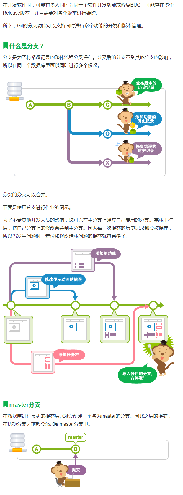

# 7. 分支


> ### 什么是分支


​	


> ### 新建分支


* ```bash
  Administrator@÷▒▒▒▒ MINGW64 /d/Program Files(x86)/git/workspace (master)
  $ git branch
  * master
  ```

  <code>git branch</code>   不带参，表示查看所有分支的信息


* ```bash
  Administrator@÷▒▒▒▒ MINGW64 /d/Program Files(x86)/git/workspace (master)
  $ git branch newbranch
  
  Administrator@÷▒▒▒▒ MINGW64 /d/Program Files(x86)/git/workspace (master)
  $ git branch
  * master
    newbranch
  ```

  <code>git branch xxx</code> 带参数，表示创建一个新的分支


> ### 切换分支


* ```bash
  Administrator@÷▒▒▒▒ MINGW64 /d/Program Files(x86)/git/workspace (master)
  $ git checkout newbranch
  Switched to branch 'newbranch'
  M       test.java
  
  Administrator@÷▒▒▒▒ MINGW64 /d/Program Files(x86)/git/workspace (newbranch)
  $ git branch
    master
  * newbranch
  ```

   使用 <code>git checkout branchName</code>  表示切换指定的分支为当前工作分支，

  注意在打印所有分支信息的时候，在分支名前面有一个<code>*</code> 表示 当前的工作分支


* ```bash
  Administrator@÷▒▒▒▒ MINGW64 /d/Program Files(x86)/git/workspace (newbranch)
  $ git branch
    master
  * newbranch
  
  Administrator@÷▒▒▒▒ MINGW64 /d/Program Files(x86)/git/workspace (newbranch)
  $ ls -l
  total 2
  -rw-r--r-- 1 Administrator 197121 209  6月 30 15:27 test.java
  -rw-r--r-- 1 Administrator 197121  32  6月 30 15:54 testrollback.java
  
  Administrator@÷▒▒▒▒ MINGW64 /d/Program Files(x86)/git/workspace (newbranch)
  $ rm testrollback.java
  
  Administrator@÷▒▒▒▒ MINGW64 /d/Program Files(x86)/git/workspace (newbranch)
  $ ls
  test.java
  
  Administrator@÷▒▒▒▒ MINGW64 /d/Program Files(x86)/git/workspace (newbranch)
  $ git add testrollback.java
  
  Administrator@÷▒▒▒▒ MINGW64 /d/Program Files(x86)/git/workspace (newbranch)
  $ git commit testrollback.java -m 'del testrollback.java'
  [newbranch 1c96b39] del testrollback.java
   1 file changed, 4 deletions(-)
   delete mode 100644 testrollback.java
  
  Administrator@÷▒▒▒▒ MINGW64 /d/Program Files(x86)/git/workspace (newbranch)
  $ git reflog
  1c96b39 (HEAD -> newbranch) HEAD@{0}: commit: del testrollback.java
  4130719 (master) HEAD@{1}: checkout: moving from master to newbranch
  4130719 (master) HEAD@{2}: checkout: moving from newBranch to master
  f207821 HEAD@{3}: commit: del file testrollBack
  4130719 (master) HEAD@{4}: checkout: moving from master to newBranch
  4130719 (master) HEAD@{5}: reset: moving to 4130719
  46a2077 HEAD@{6}: commit: del testrollback.java
  4130719 (master) HEAD@{7}: reset: moving to 4130719
  4c42580 HEAD@{8}: reset: moving to 4c42580
  4130719 (master) HEAD@{9}: reset: moving to 4130719
  4c42580 HEAD@{10}: reset: moving to 4c42580
  4130719 (master) HEAD@{11}: reset: moving to 4130719
  4130719 (master) HEAD@{12}: commit: second file hai been commit
  c1f743a HEAD@{13}: commit: the seventh edit test.java
  9549748 HEAD@{14}: commit: the fifth edit test.java
  3d67330 HEAD@{15}: commit: fourly edit test.java
  09c6b9d HEAD@{16}: commit: threedly edition
  953862c HEAD@{17}: commit: nothing has been modified
  4c42580 HEAD@{18}: commit (initial): this is test
  Administrator@÷▒▒▒▒ MINGW64 /d/Program Files(x86)/git/workspace (newbranch)
  $ git checkout master
  Switched to branch 'master'
  M       test.java
  
  Administrator@÷▒▒▒▒ MINGW64 /d/Program Files(x86)/git/workspace (master)
  $ ls
  test.java  testrollback.java
  ```

​		从bash 中可以看到我们在新的分支中删除了工作区的testrollback.java 文件并且把删除动作提交到了数据库

​		当我们切换到master 分支的时候，查看当前工作区的文件，发现文件还是存在的


> ###  删除分支


* 

  ```bash
  Administrator@÷▒▒▒▒ MINGW64 /d/Program Files(x86)/git/workspace (master)
  $ git branch -d newbranch
  error: The branch 'newbranch' is not fully merged.
  If you are sure you want to delete it, run 'git branch -D newbranch'.
  ```

  当我们尝试删除新的分支的时候，bash 提示我们新的分支并没有和master 分支merge,所以无法使用-d 命令参数，建议使用-D 命令

  ```bash
  Administrator@÷▒▒▒▒ MINGW64 /d/Program Files(x86)/git/workspace (master)
  $ git branch -D newbranch
  Deleted branch newbranch (was 1c96b39).
  
  Administrator@÷▒▒▒▒ MINGW64 /d/Program Files(x86)/git/workspace (master)
  $ git branch
  * master
  ```

  


> ### 合并分支


​	<code>git merge [branchName]</code> 将指定的分支合并到当前分支

* ```bash
  Administrator@÷▒▒▒▒ MINGW64 /d/Program Files(x86)/git/workspace (master)
  $ git branch
  * master
  
  Administrator@÷▒▒▒▒ MINGW64 /d/Program Files(x86)/git/workspace (master)
  $ git branch newBranch
  
  Administrator@÷▒▒▒▒ MINGW64 /d/Program Files(x86)/git/workspace (master)
  $ git checkout newBranch
  Switched to branch 'newBranch'
  M       test.java
  
  Administrator@÷▒▒▒▒ MINGW64 /d/Program Files(x86)/git/workspace (newBranch)
  $ ls
  test.java  testrollback.java
  
  Administrator@÷▒▒▒▒ MINGW64 /d/Program Files(x86)/git/workspace (newBranch)
  $ rm test.java
  
  Administrator@÷▒▒▒▒ MINGW64 /d/Program Files(x86)/git/workspace (newBranch)
  $ rm testrollback.java
  
  Administrator@÷▒▒▒▒ MINGW64 /d/Program Files(x86)/git/workspace (newBranch)
  $ git add -A
  
  Administrator@÷▒▒▒▒ MINGW64 /d/Program Files(x86)/git/workspace (newBranch)
  $ git commit -m 'del all fie'
  [newBranch fe3a452] del all fie
   2 files changed, 19 deletions(-)
   delete mode 100644 test.java
   delete mode 100644 testrollback.java
  
  Administrator@÷▒▒▒▒ MINGW64 /d/Program Files(x86)/git/workspace (newBranch)
  $ git status
  On branch newBranch
  nothing to commit, working tree clean
  
  Administrator@÷▒▒▒▒ MINGW64 /d/Program Files(x86)/git/workspace (newBranch)
  $ git checkout master
  Switched to branch 'master'
  
  Administrator@÷▒▒▒▒ MINGW64 /d/Program Files(x86)/git/workspace (master)
  $ git merge newBranch
  Updating 4130719..fe3a452
  Fast-forward
   test.java         | 15 ---------------
   testrollback.java |  4 ----
   2 files changed, 19 deletions(-)
   delete mode 100644 test.java
   delete mode 100644 testrollback.java
  
  Administrator@÷▒▒▒▒ MINGW64 /d/Program Files(x86)/git/workspace (master)
  $ ls -l
  total 0
  ```

​	

​		如上面的bash，新建了一个分支newBranch ,切换到新分支，然后删除工作区的所有文件，将删除动作提交		索引区，再把索引区的删除记录提交给数据库

​		切换到master 分支，对newBranch 分支进行合并<code>git merge newBranch</code>

​		 将newBranch 分支合并后会发现，newBranch 分支中的动作会被提交到master 分支中，文件都被删除了

​		


> ### 合并时产生的冲突


*  当在新建的分支中对某文件[whaterver.txt] 进行编辑，修改，删除等一系列操作的后，如果在原来的分支

   master 上也对该文件进行了操作，那么在合并的时候就会产生冲突

  * 比如<code>git branch newBranch</code>  然后删除了新分支中的文件，

  * 切换分支到master,对该文件进行了修改

  * 然后执行命令把新分支merge 到master 分支中，那么这个时候就会报错

  * ```bash
    $ git merge newBranch
    CONFLICT (modify/delete): a.js deleted in newBranch and modified in HEAD. Version HEAD of a.js left in tree.
    Automatic merge failed; fix conflicts and then commit the result.
    ```

  * 在发生冲突后需要手动的去处理

  * ```bash
    $ git status
    On branch master
    You have unmerged paths.
      (fix conflicts and run "git commit")
      (use "git merge --abort" to abort the merge)
    
    Unmerged paths:
      (use "git add/rm <file>..." as appropriate to mark resolution)
    
            deleted by them: a.js
    
    no changes added to commit (use "git add" and/or "git commit -a")
    
    Administrator@÷▒▒▒▒ MINGW64 /d/Program Files(x86)/git/workspace (master|MERGING)
    $ git add a.js
    
    Administrator@÷▒▒▒▒ MINGW64 /d/Program Files(x86)/git/workspace (master|MERGING)
    $ git status
    On branch master
    All conflicts fixed but you are still merging.
      (use "git commit" to conclude merge)
    
    
    Administrator@÷▒▒▒▒ MINGW64 /d/Program Files(x86)/git/workspace (master|MERGING)
    $ git commit -m 'save the file'
    [master f25f68d] save the file
    
    Administrator@÷▒▒▒▒ MINGW64 /d/Program Files(x86)/git/workspace (master)
    $ ls
    a.js
    
    Administrator@÷▒▒▒▒ MINGW64 /d/Program Files(x86)/git/workspace (master)
    $ cat a.js
    document.querySelector('sucker');
    document.querySelector('.name').closet('#titleBox')
    ```

  * 如上面的 bash ，使用<code>git status</code> 会提示你 使用<code>git add</code> 命令去处理冲突，然后使用<code>git commit</code> 

    命令去执行merge(这个时候git commit 就不再是提交的意思了


* 在上面的冲突的例子中我们是保存了master做的修改，而忽略了newBranch的删除动作，那么如何保存newBranch 的删除动作，而忽略master的修改呢？

  * ```bash
    Unmerged paths:
      (use "git add/rm <file>..." as appropriate to mark resolution)
    ```

  * 在这里提示我们解决冲突，有两个办法，第一个就是与另一个开发人员协商修改，然后git add 然后执行git commit 执行合并，如何我们在合并中以newBranch 的主导行为怎么办呢？

  * rm <file> 然后再 执行git add,然后再git commit 执行合并

